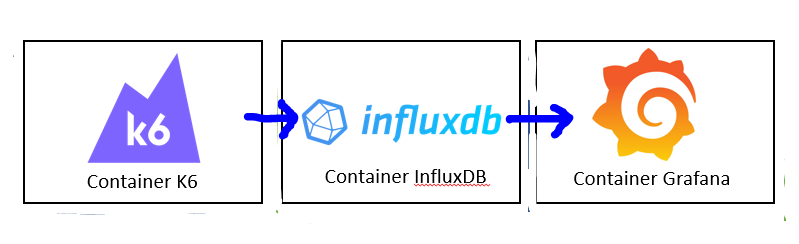

```brew install k6```

plugin (2587): https://grafana.com/grafana/dashboards/2587-k6-load-testing-results/

docs: https://medium.com/@nairgirish100/k6-with-docker-compose-influxdb-grafana-344ded339540

run db and grafana
```docker-compose up -d influxdb grafana```

run tests
```docker-compose run --rm k6 run /scripts/get-200.test.js```

1. Open data source http://localhost:3000/datasources
2. Add InfluxDB with url http://influxdb:8086 and database "k6"
3. Import K6 dashboard (2587) http://localhost:3000/dashboard/import

# Метрики k6 Теста

1. **data_received**: Количество данных, полученных во время теста.

2. **data_sent**: Количество данных, отправленных во время теста.

3. **http_req_blocked**: Время, в течение которого запросы были заблокированы до отправки.

4. **http_req_connecting**: Время, затраченное на установку соединения с сервером.

5. **http_req_duration**: Общее время выполнения HTTP запросов.

6. **http_req_failed**: Процент неудачных HTTP запросов.

7. **http_req_receiving**: Время, затраченное на получение данных от сервера.

8. **http_req_sending**: Время, затраченное на отправку данных на сервер.

9. **http_req_tls_handshaking**: Время, затраченное на установку безопасного TLS соединения.

10. **http_req_waiting**: Время ожидания ответа от сервера.

11. **http_reqs**: Общее количество HTTP запросов.

12. **iteration_duration**: Общее время выполнения итерации теста.

13. **iterations**: Общее количество итераций.

14. **vus**: Количество виртуальных пользователей в моменты времени.

15. **vus_max**: Максимальное количество виртуальных пользователей, установленное в тесте.
